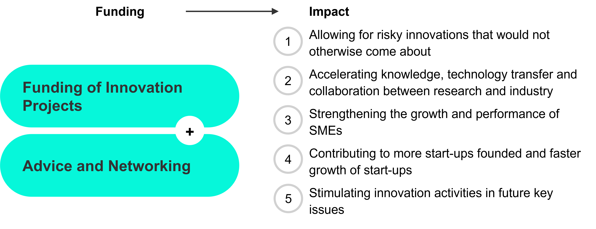

```js
import { html } from "npm:htl";
import { plot_erhebung} from "../functions.js"
```

# Methodology
## Design of the Impact Monitoring System

Following the development of a conceptual framework, an impact monitoring system was introduced in 2021 amongst the implementation partners of the innovation projects through systematic surveys and has since been continuously expanded to include further instruments. The impact measurement objectives set out in the framework have been achieved, and a wealth of meaningful data is now available. This data enables conclusions to be drawn regarding the diverse impacts of innovation promotion.

Innosuisse’s impact monitoring is based on mandatory and exhaustive surveys of all implementation and research partners of the *innovation projects*, the SMEs participating in the *innovation cheques* scheme, and all start-ups participating in *Core Coaching*. The surveys are carried out among the implementation partners of the innovation projects and the start-ups in coaching upon completion of the funding and again three years after completion. For the *Innovation Booster* and *BRIDGE Proof of Concept* projects, the results are based on monitoring data from the ongoing initiatives. 

<div>${plot_erhebung()}</div>

## Details of the surveys
In the surveys completed by funding beneficiaries, a 6-point scale is generally used (e.g. (1) no significance, (2) low significance, (3) somewhat low significance, (4) somewhat high significance, (5) high significance, (6) very high significance). Where appropriate, yes/no questions are asked and selected economic indicators are collected.

The surveys are designed so that the funding beneficiaries’ self-assessments focus on the detailed characterisation of the innovation endeavours and on the direct impact of funding.

The indicators presented are based on the following data sources:

<div class="card" style="width: 600px;">

| Support offer                            | Data source                                         |
|----------------------------------|------------------------------------------------|
| Implementation partners in innovation projects | Average for reporting years 2023–25           |
| Innovation cheques               | Average for reporting years 2023–25                              |
| Research partners in innovation projects | Average for reporting years 2023–25                           |
| BRIDGE Discovery         | Average for reporting years 2023–25    |
| BRIDGE Proof of Concept         | Own research, reporting years up to 2025    |
| Innovation Booster              | Average for reporting years 2023–25 |              
| Start-up Core Coaching               | Average for reporting years 2023–25         |

</div>

Where available, the results are presented as average across the three most recent survey years. The response rate for the surveys ranges from around 50% (three years after end of project) to over 75% (end of project), thereby allowing for statistically valid conclusions. 

## Tabular summary of the results

The detailed results can be found in a tabular summary ([⤓&nbsp;Excel](/_file/data//wirkungsindikatoren-2023-2025.xlsx)), organised by funding instruments, target groups, five thrusts of impact orientation and a differentiated categorisation of impact
  
## Innosuisse’s support offers and impact objectives (Outcomes)
Innosuisse’s support offers can be divided into two overarching funding areas (see the overview below): 
1. [Funding of Innovation Projects](/de/projekte-unternehmen-forschende)
2. [Advice and Networking](/de/beratung-und-netzwerk)
  
The overview below shows the five thrusts (outcomes) of Innosuisse to which the support offers are intended to make a contribution. The survey results presented are intended to provide insights into the achievement of innovation promotion objectives and offer a sound basis for assessing the effectiveness of the support measures and developing them further in a targeted manner.

<div class="card" style="width: 600px;">
  
</div>

The results include, on the one hand, short- to medium-term impacts upon completion of the innovation endeavours or shortly after project completion. On the other hand, longer-term impacts are also presented, such as market implementation or employment impacts. The allocation to the five thrusts outlined is not explicitly shown in this report, but is made transparent in the tabular summary (see above). This also applies to the rating scales used for calculating the reported indicators. 

## Further Development of Impact Monitoring
The current impact monitoring framework is being expanded in stages. The focus of the further development is on *Start-up Innovation Projects*, *international projects*, the *Flagship Initiative* and the *BRIDGE Proof of Concept* carried out in collaboration with the Swiss National Science Foundation (SNSF). Results relating to these instruments will be included in the reporting from 2027 onwards. No data is yet available for these instruments, some of which involve significant funding (*Flagship Initiative*, *Start-up innovation projects*, *Swiss Accelerator*), as the first projects were not completed until 2025.
